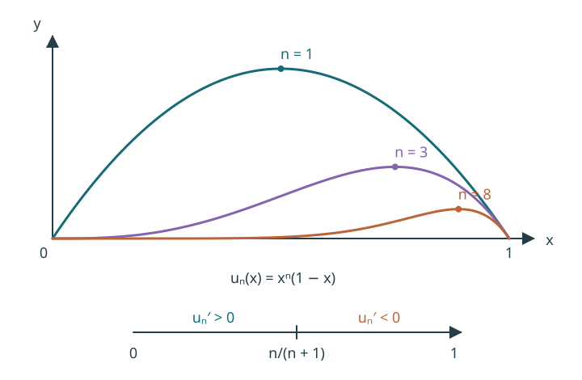

# Лекции 27–28. Функциональные ряды {#sec-series}

::: {.source}
Источник: `27,28_функциональные_ряды.pdf`, страницы 1–9. В оригинале: неделя 14, § 5, подразделы 5.1–5.4. Граница между двумя лекциями не обозначена.
:::

## Общие понятия

::: {#def-functional-series}
## Функциональный ряд

Для функций $u_n:\Omega\to\mathbb R$ или $\mathbb C$ выражение $\sum_{n=1}^\infty u_n(x)$ называется функциональным рядом. Его частичные суммы:
$$
S_n(x)=\sum_{k=1}^n u_k(x).
$$
Множество $E$ точек, в которых числовой ряд сходится, называется множеством поточечной сходимости; сумма ряда на нём обозначается $S(x)$.
:::

::: {#def-uniform-series}
## Равномерная сходимость ряда

Ряд $\sum u_n(x)$ равномерно сходится на $\Omega$ к $S$, если $S_n\rightrightarrows S$ на $\Omega$. В таком случае $\Omega\subseteq E$.

Для сходящегося ряда остаток после $m$ членов равен
$$
r_m(x)=S(x)-S_m(x)=\sum_{n=m+1}^\infty u_n(x).
$$ {#eq-series-remainder}
:::

::: {#thm-series-necessary}
## Необходимое условие равномерной сходимости

Если $\sum u_n(x)$ равномерно сходится на $\Omega$, то $u_n\rightrightarrows0$ на $\Omega$, то есть $\lVert u_n\rVert_\infty\to0$.
:::

::: {.proof}
Для $n\ge2$ имеем $u_n=S_n-S_{n-1}$. Поэтому
$$
\lVert u_n\rVert_\infty\le\lVert S_n-S\rVert_\infty+\lVert S_{n-1}-S\rVert_\infty\longrightarrow0.
$$
:::

**Редакторское исправление (с. 1).** В оригинале стоит $u_n=S_{n+1}-S_n$; правая часть равна $u_{n+1}$.

### Два примера

::: {#exm-geometric-series}
## Геометрический ряд

Ряд $\sum_{n=1}^\infty x^n$ сходится поточечно на $E=(-1,1)$. На всём $E$ он не сходится равномерно: $\sup_{x\in(-1,1)}|x^n|=1$, и необходимое условие не выполнено.

На $\Omega=[-q,q]$, $0<q<1$, имеем
$$
S_n(x)=\frac{x-x^{n+1}}{1-x},\qquad S(x)=\frac{x}{1-x},
$$
$$
\lVert S_n-S\rVert_\infty
=\sup_{|x|\le q}\frac{|x|^{n+1}}{|1-x|}
\le\frac{q^{n+1}}{1-q}\longrightarrow0.
$$
Таким образом, ряд равномерно сходится на каждом $[-q,q]$.
:::

**Редакторское исправление (с. 2).** Формулы $S_n=(1-x^{n+1})/(1-x)$ и $S=1/(1-x)$ в оригинале соответствуют суммированию с $n=0$. Здесь сохранён указанный в исходном ряде нижний индекс $n=1$ и согласованы обе суммы.

::: {#exm-telescoping-series}
## Члены стремятся к нулю равномерно, ряд — нет

На $[0,1]$ рассмотрим
$$
\sum_{n=0}^\infty(x^n-x^{n+1})=\sum_{n=0}^\infty x^n(1-x).
$$
Для $n\ge1$ производная члена равна
$$
\bigl(x^n(1-x)\bigr)'=x^{n-1}\bigl(n-(n+1)x\bigr).
$$
Максимум достигается при $x=n/(n+1)$, и
$$
\sup_{x\in[0,1]}x^n(1-x)
=\left(\frac{n}{n+1}\right)^n\frac1{n+1}\longrightarrow0,
$$
так как первый множитель стремится к $1/e$, а второй — к нулю.

{#fig-telescoping width=85% fig-alt="На отрезке от нуля до единицы графики x в степени n, умноженного на 1 минус x, имеют один максимум в n/(n+1); производная меняет знак с плюса на минус."}

Однако частичные суммы телескопируются:
$$
S_n(x)=\sum_{k=0}^n(x^k-x^{k+1})=1-x^{n+1}\longrightarrow
S(x)=\begin{cases}1,&0\le x<1,\\0,&x=1.\end{cases}
$$
Сумма разрывна, хотя все частичные суммы непрерывны. Значит, равномерной сходимости нет. Более того, $\lVert S_n-S\rVert_\infty=1$.
:::

## Простейшие свойства и признаки

::: {#thm-series-linear}
## Линейность

Если $\sum u_n$ и $\sum v_n$ равномерно сходятся на $\Omega$, то для $\alpha,\beta\in\mathbb C$
$$
\sum_{n=1}^\infty(\alpha u_n+\beta v_n)
=\alpha\sum_{n=1}^\infty u_n+\beta\sum_{n=1}^\infty v_n,
$$
причём ряд слева также сходится равномерно.
:::

В оригинале доказательство предложено как упражнение.

::: {.proof}
**Дополнение редактора.** Применяем @thm-sequence-operations к частичным суммам двух рядов.
:::

::: {#thm-series-tail}
## Остатки ряда

Если $\sum u_n$ сходится поточечно на $\Omega$, то он сходится равномерно на $\Omega$ тогда и только тогда, когда $r_m\rightrightarrows0$ на $\Omega$.

При каждом фиксированном $m$ равномерная сходимость $\sum_{n=1}^\infty u_n$ эквивалентна равномерной сходимости хвоста $\sum_{n=m+1}^\infty u_n$.
:::

::: {.proof}
**Дополнение редактора к упражнению.** Первое утверждение следует из @eq-series-remainder. Во втором при добавлении или удалении конечной суммы разность частичной суммы и предела не меняется.
:::

::: {#thm-series-cauchy}
## Критерий Коши

Ряд $\sum u_n(x)$ равномерно сходится на $\Omega$ тогда и только тогда, когда
$$
\forall\varepsilon>0\ \exists N\ \forall n>N\ \forall p\in\mathbb N:
\quad\sup_{x\in\Omega}\left|\sum_{k=n+1}^{n+p}u_k(x)\right|<\varepsilon.
$$ {#eq-series-cauchy}
:::

::: {.proof}
**Дополнение редактора.** Необходимость следует из равномерной сходимости частичных сумм. Для достаточности условие даёт числовой критерий Коши в каждой точке, то есть предел $S(x)$. Применяем оценку с $\varepsilon/2$ и переходим к пределу $p\to\infty$: $\sup_x|S(x)-S_n(x)|\le\varepsilon/2<\varepsilon$.

Это рассуждение не требует ограниченности отдельных $u_n$ или $S_n$.
:::

::: {#thm-weierstrass}
## Признак Вейерштрасса

Пусть $|u_n(x)|\le a_n$ для всех $x\in\Omega$, $n\in\mathbb N$, где $a_n\ge0$ и числовой ряд $\sum a_n$ сходится. Тогда $\sum u_n(x)$ сходится равномерно на $\Omega$ и абсолютно в каждой точке $\Omega$.
:::

::: {.proof}
$$
\sup_{x\in\Omega}\left|\sum_{k=n+1}^{n+p}u_k(x)\right|
\le\sum_{k=n+1}^{n+p}a_k.
$$
По критерию Коши для $\sum a_n$ правая часть мала одновременно для всех $p$. Применяем @thm-series-cauchy. Для фиксированного $x$ сходимость $\sum|u_n(x)|$ следует из сравнения с $\sum a_n$.
:::

Ряд $\sum a_n$ называется **мажорирующим**. Естественный выбор $a_n=\lVert u_n\rVert_\infty$ пригоден, если эти нормы конечны и их ряд сходится.

**Редакторское уточнение (с. 4).** Мажоранты неотрицательны и вещественны: комплексная величина не может стоять справа в неравенстве $|u_n(x)|\le a_n$.

::: {#exm-weierstrass-geometric}
## Мажоранта геометрического ряда

На $[-q,q]$, $0<q<1$, выполняется $|x^n|\le q^n$. Ряд $\sum_{n=1}^\infty q^n$ сходится, поэтому @thm-weierstrass ещё раз даёт равномерную сходимость геометрического ряда.

На $(-1,1)$ тот же ряд сходится абсолютно в каждой точке, но не равномерно.
:::

::: {#exm-alternating-functional}
## Условная и равномерная сходимость

Ряд
$$
\sum_{n=1}^\infty\frac{(-1)^{n+1}}{x^2+n},\qquad x\in\mathbb R,
$$
сходится в каждой точке по признаку Лейбница. При этом
$$
\lVert u_n\rVert_\infty=\frac1n\longrightarrow0,
$$
но ряд из этих норм расходится, и признак Вейерштрасса неприменим.

Оценка остатка знакопеременного ряда даёт
$$
|r_n(x)|\le\frac1{x^2+n+1}\le\frac1{n+1}.
$$
Поэтому ряд всё же сходится равномерно на всей $\mathbb R$.

Абсолютной сходимости нет ни в одной точке: при фиксированном $x$ и достаточно больших $n$ имеем $x^2+n\le2n$, откуда $1/(x^2+n)\ge1/(2n)$.
:::

::: {#exm-absolute-not-uniform}
## Абсолютная сходимость не гарантирует равномерную

Ряд $\sum_{n=1}^\infty(1-x)x^n$ сходится абсолютно на $(-1,1]$: при $|x|<1$ это геометрический ряд, при $x=1$ все члены нулевые. Его сумма равна $x$ при $-1<x<1$ и нулю при $x=1$. Она разрывна в $1$, следовательно сходимость неравномерна.
:::

Таким образом, абсолютная поточечная и равномерная сходимость не следуют друг из друга.

::: {#thm-functional-majorant}
## Функциональная мажоранта

Если $|u_n(x)|\le a_n(x)$, $a_n(x)\ge0$, а $\sum a_n(x)$ сходится равномерно на $\Omega$, то $\sum u_n(x)$ также сходится равномерно на $\Omega$.
:::

::: {.proof}
По @eq-series-cauchy и неотрицательности $a_k$,
$$
\sup_x\left|\sum_{k=n+1}^{n+p}u_k(x)\right|
\le\sup_x\sum_{k=n+1}^{n+p}a_k(x)\longrightarrow0
$$
равномерно по $p$.
:::

## Признаки Дирихле и Абеля

В обоих признаках $u_n$ могут быть комплекснозначными, а $v_n$ — **вещественными**, поскольку требуется монотонность по $n$ в каждой точке $x$.

::: {#thm-dirichlet}
## Признак Дирихле

Пусть:

1. Частичные суммы $U_N(x)=\sum_{k=1}^N u_k(x)$ равномерно ограничены: $|U_N(x)|\le C$ при всех $N$ и $x\in\Omega$.
2. Для каждого $x$ последовательность $v_n(x)$ монотонна по $n$.
3. $v_n\rightrightarrows0$ на $\Omega$.

Тогда $\sum u_n(x)v_n(x)$ равномерно сходится на $\Omega$.
:::

::: {.proof}
**Дополнение редактора: в оригинале доказательство отсутствует.** Для хвоста от $n+1$ до $m$ обозначим $A_k=\sum_{j=n+1}^k u_j$. Тогда $|A_k|\le2C$. Преобразование Абеля:
$$
\sum_{k=n+1}^m u_kv_k=A_mv_m+\sum_{k=n+1}^{m-1}A_k(v_k-v_{k+1}).
$$
Монотонная последовательность, сходящаяся к нулю, имеет постоянный знак и убывающий модуль. Поэтому
$$
\left|\sum_{k=n+1}^m u_k(x)v_k(x)\right|
\le2C\left(|v_m(x)|+\sum_{k=n+1}^{m-1}|v_k(x)-v_{k+1}(x)|\right)
=2C|v_{n+1}(x)|.
$$
Правая часть стремится к нулю равномерно по $x$, независимо от $m>n$. Применяем @thm-series-cauchy.
:::

::: {#thm-abel-test}
## Признак Абеля

Пусть $\sum u_n(x)$ равномерно сходится на $\Omega$, $v_n(x)$ монотонна по $n$ для каждого $x$, а $|v_n(x)|\le C$ для всех $n$ и $x$. Тогда $\sum u_n(x)v_n(x)$ равномерно сходится на $\Omega$.
:::

::: {.proof}
**Дополнение редактора к упражнению.** По критерию Коши при достаточно большом $n$ все хвостовые суммы $A_k=\sum_{j=n+1}^k u_j$ удовлетворяют $|A_k(x)|<\eta$ одновременно для всех $k>n$ и $x$. То же преобразование Абеля и монотонность дают
$$
\left|\sum_{k=n+1}^m u_kv_k\right|
\le\eta\left(|v_m|+|v_{n+1}-v_m|\right)\le3C\eta.
$$
Выбираем $\eta=\varepsilon/(3C)$ при $C>0$; случай $C=0$ тривиален.
:::

## Функциональные свойства суммы ряда

::: {#thm-series-continuity}
## Непрерывность суммы

Если все $u_n\in C(\Omega)$, а $\sum u_n$ сходится равномерно на $\Omega$, то $S=\sum u_n\in C(\Omega)$.
:::

::: {.proof}
Частичные суммы непрерывны и сходятся равномерно. Применяем @thm-continuity-sequence.
:::

::: {#cor-series-limit}
## Предельный переход под знаком ряда

Пусть $\sum u_n$ сходится равномерно на $\Omega$, $x_0$ — предельная точка $\Omega$, а для каждого $n$ существует конечный $a_n=\lim_{x\to x_0}u_n(x)$. Тогда $\sum a_n$ сходится и
$$
\lim_{x\to x_0}\sum_{n=1}^\infty u_n(x)
=\sum_{n=1}^\infty\lim_{x\to x_0}u_n(x)=\sum_{n=1}^\infty a_n.
$$
:::

::: {.proof}
Для частичных сумм $S_n$ имеем $\lim_{x\to x_0}S_n(x)=\sum_{k=1}^n a_k=A_n$. Применяем @cor-interchange-limits к $S_n\rightrightarrows S$.
:::

::: {#thm-series-integral}
## Почленное интегрирование

Пусть $u_n:[a,b]\to\mathbb R$, $a<b$, все $u_n\in R([a,b])$, а $\sum u_n$ сходится равномерно на $[a,b]$. Тогда $S\in R([a,b])$ и
$$
\int_a^b S(x)\,dx=\sum_{n=1}^\infty\int_a^b u_n(x)\,dx.
$$ {#eq-series-integral}
:::

::: {.proof}
**Дополнение редактора к упражнению.** Применяем @thm-integrate-sequence к частичным суммам и используем линейность интеграла для конечных сумм.
:::

::: {#thm-series-derivative}
## Почленное дифференцирование

Пусть $u_n:[a,b]\to\mathbb R$ дифференцируемы, ряд $\sum u_n'$ сходится равномерно на $[a,b]$, а $\sum u_n(x_0)$ сходится хотя бы в одной точке $x_0\in[a,b]$. Тогда $\sum u_n$ сходится равномерно на $[a,b]$, его сумма дифференцируема и
$$
S'(x)=\left(\sum_{n=1}^\infty u_n(x)\right)'
=\sum_{n=1}^\infty u_n'(x).
$$ {#eq-series-derivative}
На концах отрезка производные односторонние.
:::

::: {.proof}
**Дополнение редактора к упражнению.** Применяем @thm-differentiate-sequence к $S_n=\sum_{k=1}^n u_k$: $S_n'=\sum_{k=1}^n u_k'$ сходится равномерно, а $S_n(x_0)$ имеет конечный предел.
:::

**Редакторское исправление (с. 8–9).** В условии теоремы в оригинале утрачен штрих у ряда, который должен сходиться равномерно. Без равномерной сходимости $\sum u_n'$ приведённый вывод неверен.
