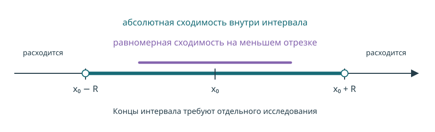
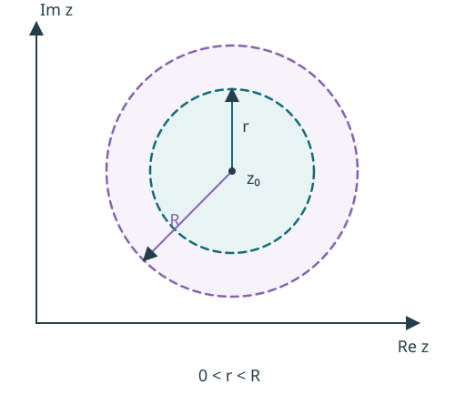
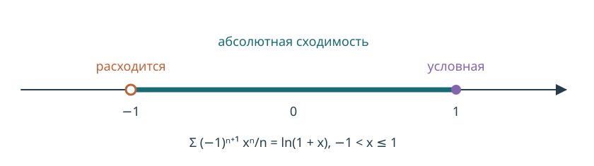

# Лекции 29–30. Степенные ряды {#sec-power-series}

::: {.source}
Источник: `29,30_степенные_ряды.pdf`, страницы 1–11. В оригинале: неделя 15, § 6, подразделы 6.1–6.5. Граница между лекциями 29 и 30 не обозначена.
:::

## Общие понятия. Первая теорема Абеля

::: {#def-power-series}
## Степенной ряд

Ряд вида
$$
\sum_{n=0}^\infty c_n(z-z_0)^n,
\qquad c_n,z_0\in\mathbb C,
$$ {#eq-power-series}
называется степенным рядом с центром $z_0$. В вещественном случае $c_n,z_0,z\in\mathbb R$.

Сдвиг $w=z-z_0$ сводит его к ряду $\sum_{n=0}^\infty c_nw^n$ с центром в нуле.
:::

::: {#thm-abel-first}
## Первая теорема Абеля

Для ряда $\sum c_nz^n$:

1. Если ряд сходится в точке $a\ne0$, то он сходится абсолютно при $|z|<|a|$ и равномерно на каждом замкнутом круге $|z|\le r<|a|$.
2. Если ряд расходится в точке $b$, то он расходится при всех $|z|>|b|$.
:::

**Редакторское уточнение (с. 1).** Равномерная сходимость гарантируется на меньших замкнутых кругах. Весь открытый круг $|z|<|a|$ не обязан быть множеством равномерной сходимости.

::: {.proof}
**1.** Из сходимости $\sum c_na^n$ следует $c_na^n\to0$, поэтому существует $M>0$ с $|c_na^n|\le M$ для всех $n$. При $|z|\le r<|a|$ положим $q=r/|a|<1$. Тогда
$$
|c_nz^n|=|c_na^n|\left|\frac za\right|^n\le Mq^n.
$$
Ряд $\sum Mq^n$ сходится. По теореме [-@thm-weierstrass] получаем равномерную сходимость на $|z|\le r$ и абсолютную в каждой его точке. Любая точка $|z|<|a|$ попадает в такой круг.

**2.** Если бы ряд сходился в точке $z_1$ с $|z_1|>|b|$, то по первой части он сходился бы в $b$. Противоречие.
:::

::: {#def-radius}
## Радиус сходимости

Радиус сходимости ряда [-@eq-power-series] определяется как
$$
R=\sup\left\{|w|:\ \sum_{n=0}^\infty c_nw^n\text{ сходится}\right\},
\qquad 0\le R\le+\infty.
$$
При $|z-z_0|<R$ ряд сходится абсолютно, при $|z-z_0|>R$ расходится. На границе $|z-z_0|=R$ требуется отдельное исследование.

В вещественном случае $(x_0-R,x_0+R)$ называется интервалом сходимости; его концы не включаются в это название независимо от сходимости в них.
:::

{#fig-interval width=95% fig-alt="Внутри интервала от x0 минус R до x0 плюс R ряд сходится абсолютно; на меньшем замкнутом отрезке равномерно. Вне интервала расходится; концы требуют отдельной проверки."}

## Формулы для радиуса сходимости

::: {#thm-cauchy-hadamard}
## Формула Коши–Адамара

Для ряда [-@eq-power-series]
$$
\frac1R=\limsup_{n\to\infty}\sqrt[n]{|c_n|}.
$$ {#eq-cauchy-hadamard}
Принимаются соглашения $1/0=+\infty$ и $1/(+\infty)=0$.
:::

::: {.proof}
Сдвигом полагаем $z_0=0$ и обозначаем $L=\limsup_n\sqrt[n]{|c_n|}$.

**Случай $L=0$.** Для каждого фиксированного $z$ имеем
$$
\sqrt[n]{|c_nz^n|}=|z|\sqrt[n]{|c_n|}\longrightarrow0.
$$
По коренному признаку Коши ряд сходится абсолютно при всех $z$, то есть $R=+\infty$.

**Случай $L=+\infty$.** Для каждого $z\ne0$ существует подпоследовательность $n_k$, вдоль которой $|z|\sqrt[n_k]{|c_{n_k}|}\to+\infty$. Тогда члены $c_{n_k}z^{n_k}$ не стремятся к нулю. Ряд расходится при $z\ne0$, а при $z=0$ равен $c_0$. Значит, $R=0$.

**Случай $0<L<+\infty$.** Если $|z|<1/L$, выбираем $\eta>0$ так, чтобы $|z|(L+\eta)<1$. По определению верхнего предела для всех достаточно больших $n$,
$$
\sqrt[n]{|c_n|}<L+\eta,
\qquad\sqrt[n]{|c_nz^n|}<|z|(L+\eta)<1.
$$
По признаку Коши ряд сходится абсолютно.

Если $|z|>1/L$, выбираем $0<\eta<L$ с $|z|(L-\eta)>1$. По определению верхнего предела существует бесконечная подпоследовательность $n_k$ с $\sqrt[n_k]{|c_{n_k}|}>L-\eta$. Вдоль неё
$$
\sqrt[n_k]{|c_{n_k}z^{n_k}|}>|z|(L-\eta)>1,
$$
так что необходимое условие сходимости нарушено. Следовательно, $R=1/L$.
:::

**Редакторское исправление (с. 4).** В строке о расходимости в оригинале встречается $1/(1/R)=R$ вместо $1/(1/R-\varepsilon)>R$. Доказательство записано через $L$ без этой неоднозначности.

::: {#cor-radius-limits}
## Частные формулы

Если существует предел $\lim_n\sqrt[n]{|c_n|}$, то его можно использовать вместо верхнего предела в формуле [-@eq-cauchy-hadamard].

Если коэффициенты $c_n$ ненулевые начиная с некоторого номера и существует (в том числе бесконечный) предел отношений, то
$$
\frac1R=\lim_{n\to\infty}\frac{|c_{n+1}|}{|c_n|}.
$$ {#eq-radius-ratio}
:::

**Дополнение редактора.** Условие о ненулевых коэффициентах нужно, чтобы отношения были определены. Ряды с пропущенными степенями следует проверять непосредственно или по формуле [-@eq-cauchy-hadamard].

## Свойства степенных рядов

::: {#thm-power-uniform}
## Сходимость внутри круга

Пусть $R>0$ — радиус ряда [-@eq-power-series]. Для каждого $0<r<R$ ряд сходится равномерно на $|z-z_0|\le r$ и абсолютно в каждой точке $|z-z_0|<R$.
:::

::: {.proof}
По определению $R$ существует точка сходимости, расстояние которой от центра больше $r$. Применяем теорему [-@thm-abel-first].
:::

::: {#thm-power-continuity}
## Непрерывность суммы

Сумма $S(z)=\sum_{n=0}^\infty c_n(z-z_0)^n$ непрерывна внутри круга $|z-z_0|<R$.
:::

::: {.proof}
Для любой точки $z^*$ внутри круга выбираем $r$ с $|z^*-z_0|<r<R$. На $|z-z_0|\le r$ ряд сходится равномерно, а каждый его член непрерывен. По теореме [-@thm-series-continuity] сумма непрерывна в $z^*$.
:::

{#fig-disks width=65% fig-alt="На комплексной плоскости два круга с общим центром z0: внутренний радиуса r и внешний радиуса R, где 0 меньше r меньше R."}

::: {#cor-abel-second}
## Вторая теорема Абеля: радиальный предел

Пусть $0<R<+\infty$ и ряд сходится в граничной точке $z^*$, $|z^*-z_0|=R$. Тогда
$$
\lim_{t\to1-}S\bigl(z_0+t(z^*-z_0)\bigr)=S(z^*),
\qquad 0\le t<1.
$$ {#eq-abel-radial}
В вещественном случае это непрерывность суммы при подходе к концу интервала изнутри.
:::

**Редакторское исправление (с. 6).** В оригинале написан неограниченный предел $z\to z^*$. При условной сходимости на границе стандартное утверждение гарантирует радиальный предел (а также предел при подходе в подходящей области Штольца). Произвольный подход из круга без дополнительных условий здесь не утверждается. Если же $\sum|c_n|R^n<\infty$, то по Вейерштрассу ряд равномерно сходится на замкнутом круге и сумма непрерывна на всей его границе.

::: {.proof}
**Дополнение редактора: в оригинале доказательство отсутствует.** Обозначим $b_n=c_n(z^*-z_0)^n$. Числовой ряд $\sum b_n$ сходится. Рассматриваем его как функциональный ряд постоянных функций на $[0,1]$: он сходится равномерно. Множители $v_n(t)=t^n$ монотонны по $n$ при каждом $t\in[0,1]$ и ограничены единицей. По теореме [-@thm-abel-test] ряд $\sum b_nt^n$ сходится равномерно на $[0,1]$. Его сумма непрерывна, что даёт формулу [-@eq-abel-radial].
:::

Радиальная формулировка сверена с [разбором теоремы Абеля Кита Конрада (University of Connecticut)](https://kconrad.math.uconn.edu/blurbs/analysis/abelthm.pdf).

### Дифференцирование

::: {#thm-power-derivative}
## Производная суммы степенного ряда

Внутри круга сходимости
$$
S'(z)=\sum_{n=1}^\infty nc_n(z-z_0)^{n-1}.
$$ {#eq-power-derivative}
Радиус производного ряда равен $R$, а $S'$ непрерывна внутри круга.
:::

::: {.proof}
Сдвигом полагаем $z_0=0$. Сначала ряд $\sum_{n=1}^\infty nc_nz^n$ имеет тот же радиус, поскольку $n^{1/n}\to1$:
$$
\limsup_n\sqrt[n]{n|c_n|}=\limsup_n\sqrt[n]{|c_n|}=1/R.
$$
Сдвиг показателя степени на единицу также сохраняет радиус: при $z\ne0$ ряд $\sum nc_nz^{n-1}$ — это $z^{-1}\sum nc_nz^n$; в нуле оба ряда определены. Поэтому производный ряд имеет радиус $R$.

Фиксируем $z^*$ с $|z^*|<R$ и выбираем $r$ с $|z^*|<r<R$. Для $z\ne z^*$,
$$
\frac{S(z)-S(z^*)}{z-z^*}
=\sum_{n=1}^\infty c_n\frac{z^n-(z^*)^n}{z-z^*}.
$$
Каждый член справа продолжается в $z=z^*$ как полином
$$
u_n(z)=c_n\bigl(z^{n-1}+z^{n-2}z^*+\cdots+(z^*)^{n-1}\bigr).
$$
При $|z|\le r$, $|z^*|<r$ получаем $|u_n(z)|\le|c_n|nr^{n-1}$. Числовой ряд этих мажорант сходится, поскольку $r<R$. По теореме [-@thm-weierstrass] ряд $\sum u_n(z)$ сходится равномерно и имеет непрерывную сумму. Поэтому
$$
\lim_{z\to z^*}\frac{S(z)-S(z^*)}{z-z^*}
=\sum_{n=1}^\infty\lim_{z\to z^*}u_n(z)
=\sum_{n=1}^\infty nc_n(z^*)^{n-1}.
$$
Непрерывность $S'$ следует из теоремы [-@thm-power-continuity] для производного ряда.
:::

**Редакторские исправления (с. 7).** В знаменателе разностного отношения $z-z_0$ заменено на $z-z^*$; заключительная формула для $S'$ согласована с формулой [-@eq-power-derivative]. В доказательстве равенства радиусов используется верхний предел, а не несуществующий в общем случае обычный предел корней.

::: {#cor-power-higher-derivatives}
## Производные всех порядков

Сумма степенного ряда бесконечно дифференцируема внутри круга сходимости, и для каждого $k\ge0$
$$
S^{(k)}(z)=\sum_{n=k}^\infty c_n\frac{n!}{(n-k)!}(z-z_0)^{n-k}.
$$ {#eq-power-higher-derivatives}
Все эти производные непрерывны внутри круга.
:::

Доказательство — последовательное применение теоремы [-@thm-power-derivative].

### Интегрирование

::: {#thm-power-integral}
## Почленное интегрирование вещественного ряда

Пусть $S(x)=\sum_{n=0}^\infty c_n(x-x_0)^n$, где $c_n,x_0\in\mathbb R$, $R>0$. Если $[a,b]\subset(x_0-R,x_0+R)$, то $S\in R([a,b])$ и
$$
\begin{aligned}
\int_a^b S(x)\,dx
&=\sum_{n=0}^\infty c_n\int_a^b \bigl((x-x_0)^n\bigr)\,dx\\
&=\sum_{n=0}^\infty\frac{c_n}{n+1}
\left((b-x_0)^{n+1}-(a-x_0)^{n+1}\right).
\end{aligned}
$$ {#eq-power-integral}
:::

::: {.proof}
Отрезок $[a,b]$ содержится в меньшем отрезке $|x-x_0|\le r<R$. Ряд на нём сходится равномерно. Применяем теорему [-@thm-series-integral].
:::

## Разложение функции. Ряд Тейлора

::: {#thm-power-coefficients}
## Коэффициенты разложения

Если $S(z)=\sum_{n=0}^\infty c_n(z-z_0)^n$ имеет положительный радиус сходимости, то
$$
c_n=\frac{S^{(n)}(z_0)}{n!},\qquad n\ge0.
$$ {#eq-taylor-coefficients}
:::

::: {.proof}
$S(z_0)=c_0$. В формуле [-@eq-power-higher-derivatives] подставляем $z=z_0$: единственный ненулевой член соответствует $n=k$, поэтому $S^{(k)}(z_0)=k!c_k$.
:::

::: {#cor-power-uniqueness}
## Единственность разложения

Если на некотором круге $|z-z_0|<r$, $r>0$,
$$
\sum_{n=0}^\infty a_n(z-z_0)^n
=\sum_{n=0}^\infty b_n(z-z_0)^n,
$$
то $a_n=b_n$ для всех $n\ge0$.
:::

Это следует из формулы [-@eq-taylor-coefficients]. Для ряда с центром в нуле: если сумма чётна, все коэффициенты нечётных степеней равны нулю; если нечётна, все коэффициенты чётных степеней равны нулю.

**Редакторское уточнение (с. 9).** Утверждение о чётности относится к ряду с центром $0$; при другом центре нужно рассматривать симметрию относительно $z_0$.

::: {#def-taylor-series}
## Ряд Тейлора и ряд Маклорена

Функции $f$, имеющей производные всех порядков в точке $z_0$, сопоставляют ряд
$$
\sum_{n=0}^\infty\frac{f^{(n)}(z_0)}{n!}(z-z_0)^n.
$$ {#eq-taylor-series}
Он называется рядом Тейлора функции в точке $z_0$, а при $z_0=0$ — рядом Маклорена.
:::

Для вещественной бесконечно дифференцируемой функции радиус этого ряда и совпадение его суммы с $f$ требуют отдельного исследования. Любой сходящийся степенной ряд является рядом Тейлора своей суммы.

**Редакторское уточнение (с. 9).** В оригинале вместе рассматриваются вещественные и комплексные функции. Для комплексной функции, голоморфной в окрестности, разложение в ряд Тейлора там существует; предостережение о несовпадении суммы с функцией относится к общему вещественному $C^\infty$-случаю.

::: {#def-analytic}
## Аналитичность

Функция называется аналитической (регулярной) в точке $z_0$, если в некоторой её окрестности допускает представление сходящимся степенным рядом с центром $z_0$.
:::

### Достаточные условия разложения вещественной функции

::: {#thm-taylor-sufficient}
## Оценки производных

Пусть $f:\mathbb R\to\mathbb R$ бесконечно дифференцируема в окрестности отрезка $|x-x_0|\le r$, $r>0$. Каждого из следующих условий достаточно для совпадения $f$ со своим рядом Тейлора на этом отрезке:

1. $0<r<1$ и существует **одна** константа $M>0$ такая, что $|f^{(n)}(x)|\le M n!$ для всех $n\ge0$ и всех $|x-x_0|\le r$.
2. Существует **одна** константа $M>0$ такая, что $|f^{(n)}(x)|\le M$ для всех $n\ge0$ и всех $|x-x_0|\le r$.
:::

**Редакторские уточнения (с. 10).** Константа должна быть общей для всех порядков и точек. В условии 2 добавлен модуль: односторонняя верхняя оценка $f^{(n)}(x)\le M$ не даёт приведённой в оригинале оценки модуля остатка.

::: {.proof}
По формуле Тейлора с остатком Лагранжа при некотором $c$ между $x$ и $x_0$,
$$
f(x)-\sum_{k=0}^{n-1}\frac{f^{(k)}(x_0)}{k!}(x-x_0)^k
=\frac{f^{(n)}(c)}{n!}(x-x_0)^n.
$$
В первом случае модуль остатка не превосходит $Mr^n\to0$, во втором — $Mr^n/n!\to0$. Оценки равномерны по $|x-x_0|\le r$. Поэтому в обоих случаях
$$
f(x)=\sum_{k=0}^\infty\frac{f^{(k)}(x_0)}{k!}(x-x_0)^k.
$$
:::

## Ряды Маклорена основных функций

### Экспонента

$$
e^z=\sum_{n=0}^\infty\frac{z^n}{n!},\qquad R=+\infty.
$$ {#eq-exp-series}
По формуле отношений: $|c_{n+1}|/|c_n|=1/(n+1)\to0$.

### Синус и косинус

$$
\sin z=\sum_{n=0}^\infty\frac{(-1)^n}{(2n+1)!}z^{2n+1},\qquad R=+\infty,
$$ {#eq-sin-series}
$$
\cos z=\sum_{n=0}^\infty\frac{(-1)^n}{(2n)!}z^{2n},\qquad R=+\infty.
$$ {#eq-cos-series}

**Дополнение редактора.** Для фиксированного $z$ отношение модулей соседних ненулевых членов стремится к нулю. Нулевые коэффициенты пропущенных степеней не позволяют напрямую применять формулу [-@eq-radius-ratio] ко всем коэффициентам.

### Логарифм

$$
\log(1+z)=\sum_{n=1}^\infty\frac{(-1)^{n+1}z^n}{n},\qquad R=1.
$$ {#eq-log-series}
В комплексном круге $|z|<1$ выбирается ветвь логарифма с $\log1=0$. В вещественном случае это $\ln(1+x)$.

Радиус равен единице, поскольку $\sqrt[n]{1/n}\to1$. В концах вещественного интервала:

- При $x=-1$ получаем $-\sum 1/n$, то есть расходимость.
- При $x=1$ получаем $\sum(-1)^{n+1}/n$, то есть условную сходимость по Лейбницу; по следствию [-@cor-abel-second] сумма равна $\ln2$.

{#fig-log-interval width=95% fig-alt="Ряд логарифма сходится абсолютно на интервале от минус единицы до единицы, условно в правом конце 1, расходится в левом конце минус 1 и за пределами интервала."}

### Биномиальный ряд

$$
(1+x)^p=\sum_{n=0}^\infty\binom pn x^n,
\qquad\binom p0=1,\quad
\binom pn=\frac{p(p-1)\cdots(p-n+1)}{n!}\ (n\ge1).
$$ {#eq-binomial-series}
Для $p\in\mathbb R\setminus\{0,1,2,\ldots\}$ радиус равен $1$, поскольку
$$
\left|\frac{c_{n+1}}{c_n}\right|=\left|\frac{p-n}{n+1}\right|\longrightarrow1.
$$
Равенство выполняется при $|x|<1$; сходимость в концах требует отдельного исследования.

**Редакторское исправление (с. 11).** Если $p$ — неотрицательное целое число, ряд обрывается и является многочленом; тогда $R=+\infty$, а не $1$. Для $n=0$ произведение в числителе пустое и равно единице.

**Дополнение редактора к списку разложений.** На вещественных отрезках разложения экспоненты, синуса и косинуса следуют из формулы Тейлора и оценки остатка; комплексные формулы задают их стандартные целые продолжения. Для логарифма можно проинтегрировать геометрический ряд $1/(1+x)=\sum_{n\ge0}(-x)^n$ на отрезке внутри $(-1,1)$. Для биномиального ряда коэффициенты удовлетворяют $(n+1)c_{n+1}=(p-n)c_n$. Поэтому его сумма $B$ решает $(1+x)B'=pB$, $B(0)=1$; на $(-1,1)$ отсюда $B=(1+x)^p$.
